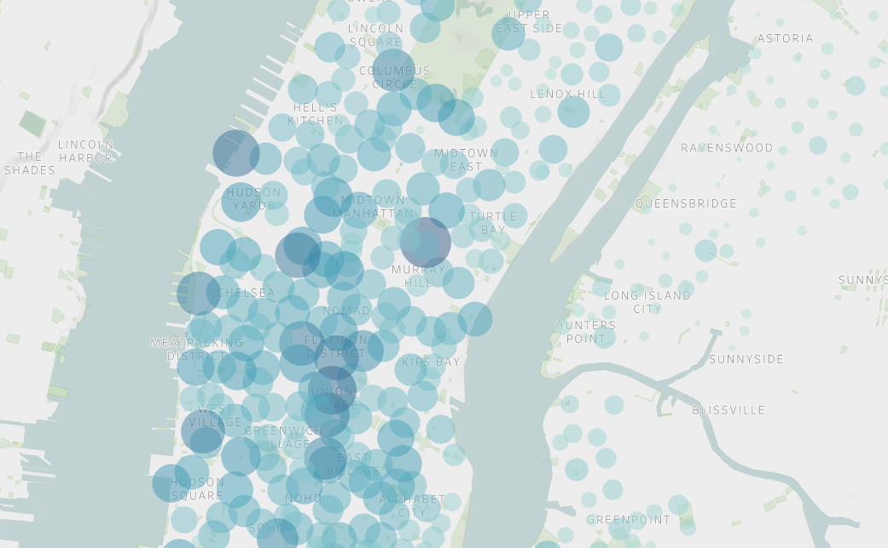

# Visualizing NYC Citi Bike with Tableau

# Overview
This project used raw CSV data from Citi Bikes program to create a persuasive and immersive story powered by Tableau.  

## **See the presentation [here!](https://public.tableau.com/app/profile/hale.soyster/viz/CitiBikeChallenge_16658652770180/Story1?publish=yes)**

# Results

Tableau comes out of the box with some powerful visualization tools.  Using the latitude and longitude coordinates of Citi Bike locations in the CSV file, you can present the density of data elements on a map with stunning clarity and built-in mapping features.  

Tableau also allows users to customize the visualizations using a query language similar to SQL with easy-to-use instructions.   

You can easily compare visualizations using dashboards to bring even more power to your storytelling.

With more data, it would have been interesting to visualize the density of demand by borough like this map I created with data from new housing starts in Austin.

 
